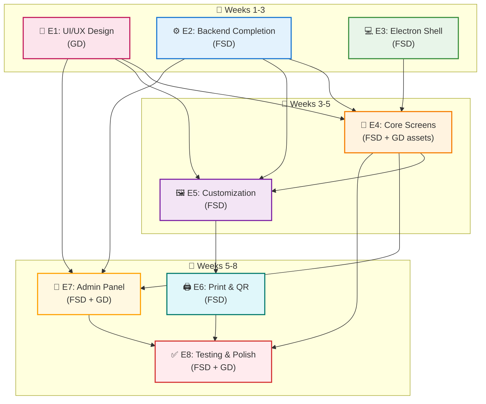

# Photobooth Application — Project Epics
## Kiosk-Mode Web-Based Photobooth Implementation

**Timeline**: 2 Months (8 Weeks)
**Team**: 1 Full-Stack Developer (FSD), 1 Graphic Designer / UI-UX (GD)

**Goal**: Complete implementation of the kiosk-mode photobooth application as defined in the [PRD](file:///g:/Projects/photobooth-software/prd/prd.md), from design assets through to a production-ready, unattended kiosk experience.

---

## Current State Assessment

Before planning, here is what already exists and what is missing:

### What Exists (Python Backend — `hw_controller`)

| Component          | File                    | Status     | Notes                                                                                                                                         |
| ------------------ | ----------------------- | ---------- | --------------------------------------------------------------------------------------------------------------------------------------------- |
| State Machine      | `core/state_machine.py` | ⚠️ Partial | 8 states implemented; PRD requires 13                                                                                                         |
| Session Manager    | `core/session.py`       | ⚠️ Partial | Basic flow only (start → countdown → capture → review → print → complete). Missing onboarding, payment, customization, capture setup, preview |
| IPC Server         | `ipc/server.py`         | ✅ Done     | ZeroMQ ROUTER + PUB fully wired                                                                                                               |
| IPC Protocol       | `ipc/protocol.py`       | ✅ Done     | JSON-RPC 2.0 helpers, error codes                                                                                                             |
| Camera Controller  | `hardware/camera.py`    | ✅ Done     | gphoto2 capture + download + auto-reconnect                                                                                                   |
| Printer Controller | `hardware/printer.py`   | ✅ Done     | Cross-platform silent printing                                                                                                                |
| Database           | `db/database.py`        | ✅ Done     | SQLite + WAL mode + session factory                                                                                                           |
| DB Models          | `db/models.py`          | ⚠️ Partial | Session, Media, SyncJob. Missing: Payment, FrameConfig                                                                                        |
| Sync Worker        | `core/sync_worker.py`   | ⚠️ Stub    | Poll loop works; actual upload is placeholder                                                                                                 |
| Config             | `config.py`             | ⚠️ Partial | Has basics; missing payment, preview, timeout, asset configs                                                                                  |
| Main App           | `main.py`               | ⚠️ Partial | Wires existing subsystems; missing payment, onboarding, customization handlers                                                                |
| Tests              | `tests/`                | ⚠️ Partial | Tests for state machine + database only                                                                                                       |

### What Exists (Electron)

| Component | File | Status | Notes |
|-----------|------|--------|-------|
| IPC Client | `electron/main/ipc_client.ts` | ✅ Done | ZeroMQ DEALER + SUB with timeout + event routing |

### What's Missing Entirely

| Component                | Notes                                                     |
| ------------------------ | --------------------------------------------------------- |
| **React Frontend**       | No screens, components, hooks, or store exist             |
| **Electron Shell**       | No window management, no contextBridge, no preload script |
| **UI/UX Design**         | No mockups, no design system, no asset files              |
| **Payment Controller**   | No QRIS gateway integration, no serial coin acceptor      |
| **Camera Preview**       | No MJPEG streaming server                                 |
| **Composite Renderer**   | No frame layout rendering engine                          |
| **QR / Download System** | No QR generation, no download URL management              |
| **Admin Panel**          | No admin screens, no admin API handlers                   |

---

## Executive Summary

| Epic | Owner | Duration | Weeks | Description |
|------|-------|----------|-------|-------------|
| E1 | GD | 10 days | 1–3 | UI/UX Design & Asset Creation |
| E2 | FSD | 10 days | 1–2 | Backend Completion (FSM, Payment, DB, Preview) |
| E3 | FSD | 8 days | 2–3 | Electron Shell & IPC Bridge |
| E4 | FSD + GD | 12 days | 3–5 | React Frontend — Core Screens |
| E5 | FSD | 8 days | 4–5 | Customization & Composite Rendering |
| E6 | FSD | 5 days | 5–6 | Print, QR & Download System |
| E7 | FSD + GD | 8 days | 6–7 | Admin Panel |
| E8 | FSD + GD | 5 days | 7–8 | Integration Testing & Polish |

```
Month 1 (Weeks 1-4):  Foundation & Core Experience
├── Epic 1: UI/UX Design & Asset Creation (Weeks 1-3)  ← GD
├── Epic 2: Backend Completion (Weeks 1-2)              ← FSD
├── Epic 3: Electron Shell & IPC Bridge (Weeks 2-3)     ← FSD
└── Epic 4: React Frontend — Core Screens (Weeks 3-5)   ← FSD (+GD assets)

Month 2 (Weeks 5-8):  Features, Admin & Polish
├── Epic 5: Customization & Composite Rendering (Weeks 4-5)  ← FSD
├── Epic 6: Print, QR & Download System (Weeks 5-6)          ← FSD
├── Epic 7: Admin Panel (Weeks 6-7)                           ← FSD + GD
└── Epic 8: Integration Testing & Polish (Weeks 7-8)          ← FSD + GD
```

**Parallel work note:** The GD works independently on design/assets (Epic 1) during Weeks 1–3, while the FSD builds backend + Electron. They converge at Epic 4 when the FSD implements screens using the GD's finalized designs and assets.

---

## Epic 1: UI/UX Design & Asset Creation
**Duration**: Weeks 1–3 (10 working days)
**Owner**: Graphic Designer (GD)
**Priority**: P0 (Critical Path — blocks Epic 4)

### Objective
Create the complete visual design system, screen mockups, frame/layout templates, design themes, and all graphic assets needed for the photobooth kiosk experience.

### Tasks

#### 1.1 Design System & Style Guide
**Duration**: Week 1 (2 days)
**Dependencies**: None
**Output**: Design tokens, typography, color palette, spacing

| Sub-task | Description |
|-|-|
| 1.1.1 | Define color palette: primary, secondary, accent, background, surface, text colors — for both light and event-themed modes |
| 1.1.2 | Select typography: heading and body fonts (touch-friendly, high readability at arm's length) |
| 1.1.3 | Define spacing scale, border radii, shadow styles |
| 1.1.4 | Define touch target sizes (minimum 48px), button styles (primary, secondary, ghost) |
| 1.1.5 | Create motion/animation guidelines: transition durations, easing curves, entrance/exit patterns |

#### 1.2 Screen Mockups (High-Fidelity)
**Duration**: Week 1–2 (4 days)
**Dependencies**: 1.1
**Output**: High-fidelity mockups for all 9 screens + error/loading states

| Sub-task | Description |
|-|-|
| 1.2.1 | **Attract Screen**: Idle animation/video loop concept, call-to-action prompt, optional event branding overlay area |
| 1.2.2 | **Onboarding Screen**: 3–4 tutorial card designs with illustrations, page indicator, Skip/Next/Start buttons |
| 1.2.3 | **Payment Screen**: QRIS tab (QR code display, status indicator), Cash tab (amount counter, remaining amount), payment method toggle |
| 1.2.4 | **Capture Setup Screen**: Full-screen camera preview layout, frame guide overlay, "I'm Ready!" button |
| 1.2.5 | **Camera Capture Screen**: Countdown overlay (3-2-1), photo progress indicator, capture flash effect, thumbnail preview |
| 1.2.6 | **Customization Screen**: Layout picker, design picker, photo thumbnail grid, filter picker per photo, retake icon, live preview area, "Looks Great!" button |
| 1.2.7 | **Print Preview Screen**: Final composite at print proportions, "Print My Photos!" + "Go Back & Edit" buttons |
| 1.2.8 | **Print Result & QR Screen**: Print progress indicator, QR code display area, download URL expiry note |
| 1.2.9 | **Session Complete Screen**: Thank-you message, auto-reset countdown animation |
| 1.2.10 | **Error / Loading States**: Camera disconnected overlay, printer error overlay, payment timeout overlay, generic loading spinner |

#### 1.3 Frame Layout & Design Templates
**Duration**: Week 2 (2 days)
**Dependencies**: 1.1
**Output**: Print-ready layout templates and design themes

| Sub-task | Description |
|-|-|
| 1.3.1 | Design 5 frame layouts for print: **strip_vertical** (2×6"), **strip_horizontal**, **grid_2x2** (4×6"), **collage_1_3**, **single_large** |
| 1.3.2 | Create 4–6 frame design/theme skins (borders, backgrounds, overlays, decorative elements) — e.g. Floral, Minimalist, Retro, Party, Elegant |
| 1.3.3 | Export layout templates as JSON config (slot positions, dimensions, rotation) + design assets as individual PNG/SVG layers |
| 1.3.4 | Create layout preview thumbnails for the Customization screen picker |

#### 1.4 Graphic Assets & Illustrations
**Duration**: Week 2–3 (2 days)
**Dependencies**: 1.1, 1.2
**Output**: All graphic assets

| Sub-task | Description |
|-|-|
| 1.4.1 | Create onboarding illustrations (3–4 cards: Strike a Pose, Customize, Print & Download, Let's Go) |
| 1.4.2 | Create icon set: filter icons (Original, B&W, Sepia, Warm, Cool, Vintage), retake icon, layout thumbnails |
| 1.4.3 | Create attract screen idle animation or looping video concept |
| 1.4.4 | Create countdown number animations (3, 2, 1) and capture flash effect asset |
| 1.4.5 | Create default event logo placeholder and printer/camera error illustration |

### Epic 1 Deliverables

| Deliverable | Format | Due |
|-|-|-|
| Design System / Style Guide | Figma / PDF | Week 1 |
| All Screen Mockups (9 screens + states) | Figma / PNG | Week 2 |
| Frame Layout Templates (5) | JSON + PNG/SVG | Week 2 |
| Frame Design Themes (4–6) | PNG/SVG layers | Week 2 |
| Graphic Assets & Illustrations | SVG / PNG | Week 3 |

---

## Epic 2: Backend Completion
**Duration**: Weeks 1–2 (10 working days)
**Owner**: Full-Stack Developer (FSD)
**Priority**: P0 (Critical Path)

### Objective
Extend the existing Python backend (`hw_controller`) to support the full 13-state FSM, payment integration, camera preview streaming, customization logic, and updated database schema as required by the PRD.

### Tasks

#### 2.1 Extend State Machine to 13 States
**Duration**: Week 1 (2 days)
**Dependencies**: None (modifies existing `core/state_machine.py`)
**Output**: Updated FSM with all PRD-defined states and transitions

| Sub-task | Description |
|-|-|
| 2.1.1 | Add 5 missing states to `State` enum: `ONBOARDING`, `AWAITING_PAYMENT`, `CAPTURE_SETUP`, `CUSTOMIZATION`, `PREVIEW`, `COMPLETE` |
| 2.1.2 | Add missing triggers to `Trigger` enum: `onboarding_done`, `payment_initiated`, `payment_confirmed`, `payment_failed`, `payment_cancelled`, `capture_setup_ready`, `capture_setup_timeout`, `all_photos_done`, `retake_requested`, `customization_done`, `back_to_customize`, `print_requested` (update existing if needed) |
| 2.1.3 | Update `TRANSITIONS` dict with all PRD state transition pairs (see PRD §3.2) |
| 2.1.4 | Update existing tests in `tests/test_state_machine.py` to cover all new transitions |

**Key change**: Current flow `IDLE → COUNTDOWN` becomes `IDLE → ONBOARDING → AWAITING_PAYMENT → CAPTURE_SETUP → COUNTDOWN → ... → CUSTOMIZATION → PREVIEW → PRINTING → COMPLETE → IDLE`.

#### 2.2 Update Database Models
**Duration**: Week 1 (1 day)
**Dependencies**: None (modifies existing `db/models.py`)
**Output**: Updated ORM models matching PRD §5.2

| Sub-task | Description |
|-|-|
| 2.2.1 | Add `Payment` model (id, session_id, method, amount_target, amount_received, status, qr_code_data, transaction_ref, etc.) |
| 2.2.2 | Add `FrameConfig` model (id, session_id, layout_id, design_id, photo_order_json, custom_text) |
| 2.2.3 | Extend `Session` model with new columns: `photos_target`, `layout_id`, `design_id`, `composite_path`, `download_token`, `download_expires_at` |
| 2.2.4 | Extend `Media` model with new columns: `slot_index`, `filter_id`, `is_retake`, `retake_of`, `retake_count` |
| 2.2.5 | Extend `SyncJob` model with `session_id` FK |
| 2.2.6 | Update `tests/test_database.py` to cover new models |

#### 2.3 Payment Hardware Controller
**Duration**: Week 1–2 (3 days)
**Dependencies**: 2.1
**Output**: New `hardware/payment.py` module

| Sub-task | Description |
|-|-|
| 2.3.1 | Create `PaymentController` class with abstract interface for payment lifecycle |
| 2.3.2 | Implement QRIS gateway integration: generate payment request, poll for status, handle confirmation/expiry |
| 2.3.3 | Implement serial coin/bill acceptor driver: open serial port, parse coin insert events, accumulate amount, fire `payment_confirmed` when target reached |
| 2.3.4 | Add payment-related config to `config.py`: `PB_PAYMENT_AMOUNT`, `PB_PAYMENT_TIMEOUT`, `PB_QRIS_GATEWAY_URL`, `PB_QRIS_API_KEY`, `PB_CASH_SERIAL_PORT`, `PB_CASH_BAUD_RATE` |
| 2.3.5 | Add unit tests for payment controller (mock serial and HTTP) |

#### 2.4 Camera Preview Streaming
**Duration**: Week 1 (1 day)
**Dependencies**: None (extends existing `hardware/camera.py`)
**Output**: MJPEG HTTP preview server

| Sub-task | Description |
|-|-|
| 2.4.1 | Implement MJPEG streaming server using aiohttp: `GET /preview` endpoint on configurable port (default 8080) |
| 2.4.2 | Capture preview frames from gphoto2 at configurable FPS (default 15) |
| 2.4.3 | Add preview config to `config.py`: `PB_PREVIEW_PORT`, `PB_PREVIEW_FPS`, `PB_PREVIEW_QUALITY` |
| 2.4.4 | Wire start/stop preview into session lifecycle (start on `CAPTURE_SETUP`, stop after last capture) |

#### 2.5 Extend Session Manager & RPC Handlers
**Duration**: Week 2 (3 days)
**Dependencies**: 2.1, 2.2, 2.3, 2.4
**Output**: Updated `core/session.py` and `main.py`

| Sub-task | Description |
|-|-|
| 2.5.1 | Add onboarding methods: `onboarding_complete()`, `onboarding_skip()` → fire appropriate triggers |
| 2.5.2 | Add payment methods: `initiate_payment(method, amount)`, `check_payment_status()`, `cancel_payment()` → coordinate with PaymentController |
| 2.5.3 | Add capture setup methods: `capture_setup_ready()` → transition to COUNTDOWN |
| 2.5.4 | Add customization methods: `set_layout()`, `set_design()`, `apply_filter()`, `reorder_photos()`, `confirm_customization()` |
| 2.5.5 | Add retake methods: `retake_photo(photo_index)` → validate retake limit (max 1 per photo), transition to single-photo capture flow |
| 2.5.6 | Add composite rendering: implement `render_composite()` using Pillow — layer photos into layout template with design overlay |
| 2.5.7 | Add QR/download: `generate_download_qr()` → generate download token, create QR code image, return as base64 |
| 2.5.8 | Add inactivity timeout config to `config.py` for all screens |
| 2.5.9 | Register all new RPC methods in `main.py._register_handlers()`: `onboarding.complete`, `onboarding.skip`, `payment.initiate`, `payment.check_status`, `payment.cancel`, `capture.setup_ready`, `capture.get_preview_url`, `capture.retake`, `customize.set_layout`, `customize.set_design`, `customize.apply_filter`, `customize.reorder_photos`, `customize.confirm`, `print.request`, `print.get_status`, `download.generate_qr`, `download.get_url` |

### Epic 2 Deliverables

| Deliverable | Format | Due |
|-|-|-|
| Extended FSM (13 states) | Python Module | Week 1 |
| Updated DB Models | Python Module | Week 1 |
| Payment Controller | Python Module | Week 2 |
| Camera Preview Server | Python Module | Week 1 |
| Extended Session Manager + RPC | Python Modules | Week 2 |

---

## Epic 3: Electron Shell & IPC Bridge
**Duration**: Weeks 2–3 (8 working days)
**Owner**: Full-Stack Developer (FSD)
**Priority**: P0 (Critical Path)

### Objective
Build the Electron main process shell: window management, Python backend process spawning, contextBridge preload script, and the IPC bridge that connects the React renderer to the Python backend.

### Tasks

#### 3.1 Electron Project Setup
**Duration**: Week 2 (2 days)
**Dependencies**: None
**Output**: Electron project with build configuration

| Sub-task | Description |
|-|-|
| 3.1.1 | Initialise Electron project with TypeScript, set up `package.json` scripts (`dev`, `build`, `start`) |
| 3.1.2 | Configure electron-builder or electron-forge for packaging |
| 3.1.3 | Set up development workflow: hot-reload for renderer, watch mode for main process |
| 3.1.4 | Install dependencies: `zeromq`, `electron`, React build tooling (Vite or webpack) |

#### 3.2 Main Process — Window & Process Management
**Duration**: Week 2 (2 days)
**Dependencies**: 3.1
**Output**: `electron/main/index.ts`

| Sub-task | Description |
|-|-|
| 3.2.1 | Create `BrowserWindow` in kiosk mode: fullscreen, no frame, no menu bar, always on top, disable DevTools in production |
| 3.2.2 | Implement Python backend process spawning: `child_process.spawn("python", ["-m", "hw_controller.main"])` with stdout/stderr piping |
| 3.2.3 | Implement backend health monitoring: detect if Python process crashes, auto-restart with exponential backoff |
| 3.2.4 | Implement graceful shutdown: kill Python process on app quit, handle OS signals |
| 3.2.5 | Integrate existing `HardwareIPCClient` from `ipc_client.ts` into main process lifecycle |

#### 3.3 Preload Script & Context Bridge
**Duration**: Week 2–3 (2 days)
**Dependencies**: 3.2
**Output**: `electron/preload/preload.ts`

| Sub-task | Description |
|-|-|
| 3.3.1 | Create preload script exposing a secure `window.electronAPI` via `contextBridge.exposeInMainWorld` |
| 3.3.2 | Expose RPC method: `electronAPI.call(method, params)` → forwards to `HardwareIPCClient.call()` via IPC |
| 3.3.3 | Expose event subscription: `electronAPI.on(event, callback)` → forwards PUB/SUB events to renderer |
| 3.3.4 | Expose event unsubscription: `electronAPI.off(event, callback)` |
| 3.3.5 | Add TypeScript type declarations for `window.electronAPI` so React can consume safely |

#### 3.4 IPC Bridge Integration
**Duration**: Week 3 (2 days)
**Dependencies**: 3.2, 3.3
**Output**: End-to-end IPC working

| Sub-task | Description |
|-|-|
| 3.4.1 | Wire `ipcMain.handle` for RPC calls: renderer → main process → ZeroMQ → Python |
| 3.4.2 | Wire `ipcMain` event forwarding: Python PUB → ZeroMQ SUB → main process → `webContents.send` → renderer |
| 3.4.3 | Implement connection state management: expose backend connection status to renderer |
| 3.4.4 | Test end-to-end: call `system.status` from a test renderer page, verify response round-trip |

### Epic 3 Deliverables

| Deliverable | Format | Due |
|-|-|-|
| Electron Project Configuration | Project files | Week 2 |
| Main Process (window + Python spawn) | TypeScript | Week 2 |
| Preload Script + Context Bridge | TypeScript | Week 3 |
| IPC Bridge (end-to-end working) | TypeScript | Week 3 |

---

## Epic 4: React Frontend — Core Screens
**Duration**: Weeks 3–5 (12 working days)
**Owner**: Full-Stack Developer (FSD) + Graphic Designer (GD) for assets
**Priority**: P0 (Critical Path)

### Objective
Implement all 9 user-facing screens in React, driven by backend state via IPC events, using the design system and assets from Epic 1.

### Tasks

#### 4.1 React Project Setup & Foundation
**Duration**: Week 3 (2 days)
**Dependencies**: Epic 3 (Electron shell running)
**Output**: React app skeleton with routing and state management

| Sub-task | Description |
|-|-|
| 4.1.1 | Initialise React + TypeScript project inside the Electron renderer (Vite recommended) |
| 4.1.2 | Set up state management (Zustand) with a `boothStore` synced to backend state via IPC events |
| 4.1.3 | Implement state-driven screen routing: map each backend `State` → one screen component (no URL-based routing) |
| 4.1.4 | Create custom hooks: `useHardwareIPC()` (call/on/off), `useBoothState()` (subscribe to state changes) |
| 4.1.5 | Create `useInactivityTimeout(seconds, onTimeout)` hook for screen-level inactivity resets |
| 4.1.6 | Implement CSS design system from GD's style guide: variables, resets, typography, touch targets |

#### 4.2 Common Components
**Duration**: Week 3 (2 days)
**Dependencies**: 4.1
**Output**: Shared component library

| Sub-task | Description |
|-|-|
| 4.2.1 | `TouchButton` — large touch-friendly button with primary/secondary/ghost variants, ripple/press feedback |
| 4.2.2 | `ProgressDots` — page indicator for onboarding |
| 4.2.3 | `InactivityTimer` — visual countdown bar for screen timeouts |
| 4.2.4 | `ErrorOverlay` — fullscreen error modal with message, icon, retry/dismiss buttons |
| 4.2.5 | `LoadingSpinner` — branded loading indicator |
| 4.2.6 | `CountdownOverlay` — large animated numbers (3 → 2 → 1) overlaid on camera preview |

#### 4.3 Attract & Onboarding Screens
**Duration**: Week 3–4 (2 days)
**Dependencies**: 4.1, 4.2
**Output**: First two screens working

| Sub-task | Description |
|-|-|
| 4.3.1 | **AttractScreen**: Fullscreen idle content (animation/video), tap-anywhere to start, hidden admin gesture (5-tap corner) |
| 4.3.2 | **OnboardingScreen**: Swipeable card carousel with GD illustrations, auto-advance (5s), Skip button, page dots, final "Start" button |
| 4.3.3 | Wire Attract → `session.start` RPC call on tap |
| 4.3.4 | Wire Onboarding → `onboarding.complete` / `onboarding.skip` RPC calls |

#### 4.4 Payment Screen
**Duration**: Week 4 (2 days)
**Dependencies**: 4.2, Epic 2 (payment backend)
**Output**: Payment screen with QRIS + Cash tabs

| Sub-task | Description |
|-|-|
| 4.4.1 | **PaymentScreen**: Toggle/tabs between QRIS and Cash payment methods |
| 4.4.2 | QRIS tab: display dynamic QR code image from backend, status indicator (waiting → confirmed), instructions |
| 4.4.3 | Cash tab: real-time amount inserted counter (via `cash_inserted` events), remaining amount, progress bar |
| 4.4.4 | Cancel button → `payment.cancel` RPC |
| 4.4.5 | Auto-advance to Capture Setup on `payment_confirmed` event |
| 4.4.6 | Payment timeout handling: show "Payment timed out" → return to Attract |

#### 4.5 Capture Setup & Camera Capture Screens
**Duration**: Week 4 (2 days)
**Dependencies**: 4.2, Epic 2 (preview server)
**Output**: Camera screens working

| Sub-task | Description |
|-|-|
| 4.5.1 | **CaptureSetupScreen**: Full-screen mirrored camera preview (MJPEG `` tag), frame guide overlay, "I'm Ready!" button |
| 4.5.2 | `CameraPreview` component: connect to MJPEG stream URL from backend, handle stream errors |
| 4.5.3 | **CameraCaptureScreen**: Continue live preview + countdown overlay (3-2-1 via `countdown_tick` events), photo progress indicator ("Photo 2 of 4") |
| 4.5.4 | Capture feedback: flash/shutter effect, brief thumbnail overlay (1s) on `capture_complete` event |
| 4.5.5 | Auto-advance between photos (via `next_photo` trigger from backend), auto-advance to Customization after last photo (`all_photos_done`) |

#### 4.6 Print Preview, Print Result & Session Complete Screens
**Duration**: Week 4–5 (2 days)
**Dependencies**: 4.2
**Output**: Final three screens

| Sub-task | Description |
|-|-|
| 4.6.1 | **PrintPreviewScreen**: Show final composite at print proportions, "Print My Photos!" + "Go Back & Edit" buttons |
| 4.6.2 | **PrintResultScreen**: Print progress (via `print_progress` events), QR code for digital download, download expiry note |
| 4.6.3 | **SessionCompleteScreen**: Thank-you message, auto-reset countdown (8s default), tap-to-skip |
| 4.6.4 | Wire all screen transitions via backend state change events |

### Epic 4 Deliverables

| Deliverable | Format | Due |
|-|-|-|
| React App Skeleton + State Management | React/TS | Week 3 |
| Common Components | React/TS | Week 3 |
| Attract + Onboarding Screens | React/TS | Week 4 |
| Payment Screen | React/TS | Week 4 |
| Camera Screens (Setup + Capture) | React/TS | Week 4 |
| Print Preview + Result + Complete | React/TS | Week 5 |

---

## Epic 5: Customization & Composite Rendering
**Duration**: Weeks 4–5 (8 working days)
**Owner**: Full-Stack Developer (FSD)
**Priority**: P0 (Critical Path)

### Objective
Implement the Customization screen (layout picker, design picker, per-photo filters, photo reorder, retake) and the backend composite renderer that produces the final print-ready image.

### Tasks

#### 5.1 Customization Screen (Frontend)
**Duration**: Week 4 (3 days)
**Dependencies**: Epic 4 (React foundation), Epic 1 (design assets)
**Output**: `CustomizationScreen.tsx` and sub-components

| Sub-task | Description |
|-|-|
| 5.1.1 | **Layout Picker**: Horizontal scroll of layout thumbnails, one-tap selection → `customize.set_layout` RPC |
| 5.1.2 | **Design Picker**: Horizontal scroll of design theme thumbnails, one-tap selection → `customize.set_design` RPC |
| 5.1.3 | **Photo Thumbnail Grid**: Show all captured photos, tap-to-swap drag for reordering → `customize.reorder_photos` RPC |
| 5.1.4 | **Filter Picker (per-photo)**: Tap filter icon on a photo → opens inline filter picker (Original, B&W, Sepia, Warm, Cool, Vintage), applies CSS filter for instant preview → `customize.apply_filter` RPC for server-side |
| 5.1.5 | **Retake Button (per-photo)**: Tap retake icon → confirmation dialog → `capture.retake` RPC → transitions to single-photo capture → returns to Customization. Disable after one use per photo |
| 5.1.6 | **Live Preview**: `FrameCompositor` component renders a live preview of the assembled frame with current layout, design, photo order, and filters applied (client-side using CSS/Canvas) |
| 5.1.7 | Timer indicator showing remaining customization time, "Looks Great!" confirm button |

#### 5.2 Client-Side Filter Rendering
**Duration**: Week 4 (1 day)
**Dependencies**: 5.1
**Output**: `utils/filters.ts`

| Sub-task | Description |
|-|-|
| 5.2.1 | Define filter presets as CSS filter chains (matching PRD Appendix A) |
| 5.2.2 | Implement `applyFilter(canvas, filterId)` for Canvas-based preview |
| 5.2.3 | Implement CSS `filter` fallback for `` elements |

#### 5.3 Client-Side Frame Compositor
**Duration**: Week 4–5 (2 days)
**Dependencies**: 5.1, Epic 1 (layout templates)
**Output**: `utils/frameRenderer.ts`

| Sub-task | Description |
|-|-|
| 5.3.1 | Load layout template configuration (JSON: slot positions, dimensions) |
| 5.3.2 | Load design theme assets (border, background, overlay PNGs) |
| 5.3.3 | Render composite preview on HTML5 Canvas: place photos in slots, apply filters, overlay design |
| 5.3.4 | Support all 5 layouts from PRD Appendix B |

#### 5.4 Server-Side Composite Renderer (Backend)
**Duration**: Week 5 (2 days)
**Dependencies**: Epic 2 (session manager extended), Epic 1 (layout/design assets)
**Output**: `hw_controller/core/compositor.py`

| Sub-task | Description |
|-|-|
| 5.4.1 | Implement `CompositeRenderer` class using Pillow: load original photos, apply high-res filters, place into layout template |
| 5.4.2 | Compose final print-ready image at target DPI (300 DPI for print) |
| 5.4.3 | Save composite to `session_dir/<session_id>/composite.jpg` |
| 5.4.4 | Wire into session lifecycle: called when `print.request` or `customize.confirm` is invoked |

### Epic 5 Deliverables

| Deliverable | Format | Due |
|-|-|-|
| Customization Screen | React/TS | Week 4 |
| Client-Side Filter Utilities | TypeScript | Week 4 |
| Client-Side Frame Compositor | TypeScript | Week 5 |
| Server-Side Composite Renderer | Python Module | Week 5 |

---

## Epic 6: Print, QR & Download System
**Duration**: Weeks 5–6 (5 working days)
**Owner**: Full-Stack Developer (FSD)
**Priority**: P1 (High)

### Objective
Complete the print flow (composite → printer), QR code generation with download URLs, and the download system.

### Tasks

#### 6.1 Print Flow Integration
**Duration**: Week 5 (2 days)
**Dependencies**: Epic 5.4 (compositor), Epic 2 (printer controller exists)
**Output**: End-to-end print working

| Sub-task | Description |
|-|-|
| 6.1.1 | Wire `print.request` RPC → render composite (if not already rendered) → send to printer |
| 6.1.2 | Emit `print_progress` events during rendering and printing stages |
| 6.1.3 | Handle print failure: emit error event, allow retry or fallback to QR-only |
| 6.1.4 | Support configurable print size (4×6, 2×6) and copies via config |

#### 6.2 QR Code & Download URL Generation
**Duration**: Week 5–6 (2 days)
**Dependencies**: Epic 2 (DB models with download_token)
**Output**: QR generation + download service

| Sub-task | Description |
|-|-|
| 6.2.1 | Implement `download.generate_qr` RPC: create unique download token (64-char hex), generate QR code image (using `qrcode` library), return as base64 PNG |
| 6.2.2 | Store download token and expiry in Session record |
| 6.2.3 | Add `download.get_url` RPC: return download URL with file list (composite + individual photos) |
| 6.2.4 | Add download-related config: `PB_DOWNLOAD_BASE_URL`, `PB_DOWNLOAD_EXPIRY_DAYS`, `PB_QR_SIZE` |

#### 6.3 Frontend QR Display
**Duration**: Week 6 (1 day)
**Dependencies**: 6.2
**Output**: `QRCodeDisplay` component

| Sub-task | Description |
|-|-|
| 6.3.1 | `QRCodeDisplay` component: render base64 QR image from backend |
| 6.3.2 | Show download URL text below QR for manual entry |
| 6.3.3 | Show expiry info: "Available for N days" |

### Epic 6 Deliverables

| Deliverable | Format | Due |
|-|-|-|
| Print Flow Integration | Python + TS | Week 5 |
| QR & Download System | Python Module | Week 6 |
| QR Display Component | React/TS | Week 6 |

---

## Epic 7: Admin Panel
**Duration**: Weeks 6–7 (8 working days)
**Owner**: Full-Stack Developer (FSD) + Graphic Designer (GD) for admin UI
**Priority**: P2 (Medium — can ship MVP without admin)

### Objective
Implement the hidden admin panel accessible from the Attract screen, providing dashboard, hardware controls, session/payment settings, customization management, and maintenance tools.

### Tasks

#### 7.1 Admin Access & Authentication
**Duration**: Week 6 (1 day)
**Dependencies**: Epic 4 (Attract screen)
**Output**: Admin access flow

| Sub-task | Description |
|-|-|
| 7.1.1 | Implement 5-tap hidden gesture on Attract screen corner (within 3 seconds) |
| 7.1.2 | PIN entry screen (numeric keypad, configurable PIN, default `000000`) |
| 7.1.3 | Backend `admin.authenticate` RPC, simple token-based session |
| 7.1.4 | Admin inactivity timeout (5 minutes) → return to Attract |

#### 7.2 Admin Backend API
**Duration**: Week 6 (2 days)
**Dependencies**: 7.1
**Output**: Admin RPC handlers in `main.py`

| Sub-task | Description |
|-|-|
| 7.2.1 | `admin.get_dashboard`: today's session count, revenue, camera/printer/payment status, uptime, last 10 sessions |
| 7.2.2 | `admin.update_config`: update runtime configuration values (photos_per_session, countdown, price, timeouts) |
| 7.2.3 | `admin.test_camera`: trigger test capture, return preview |
| 7.2.4 | `admin.test_printer`: send test print |
| 7.2.5 | `admin.test_payment`: simulate QRIS/cash payment for testing |
| 7.2.6 | `admin.get_logs`: retrieve recent log entries |
| 7.2.7 | `admin.export_sessions`: export session data as CSV |
| 7.2.8 | `admin.restart_subsystem`: restart camera, printer, or IPC subsystem |

#### 7.3 Admin Frontend Screens
**Duration**: Week 6–7 (3 days)
**Dependencies**: 7.2, Epic 1 (admin UI design — GD can do simpler admin layout)
**Output**: Admin panel screens

| Sub-task | Description |
|-|-|
| 7.3.1 | **Dashboard Tab**: Session count, revenue, hardware status indicators, uptime, recent sessions table |
| 7.3.2 | **Settings Tab**: Session settings (photo count, countdown, timeouts), payment settings (price, QRIS config, cash config, enable/disable methods) |
| 7.3.3 | **Hardware Tab**: Camera connect/disconnect + test capture, printer select + test print, coin acceptor test mode |
| 7.3.4 | **Customization Tab**: Upload/manage layout and design templates, set defaults, enable/disable items, configure filters |
| 7.3.5 | **Event Branding Tab**: Set event name, upload logo, lock customization options |
| 7.3.6 | **Maintenance Tab**: Error log viewer, export sessions, clear history, restart subsystems, system restart |

#### 7.4 Admin UI Design (GD)
**Duration**: Week 6 (2 days, parallel with backend)
**Dependencies**: Epic 1 design system
**Output**: Admin panel mockups

| Sub-task | Description |
|-|-|
| 7.4.1 | Design simplified admin panel layout (tabs/sidebar, table styles, form inputs) |
| 7.4.2 | Design status indicator icons (connected/disconnected, ready/error) |
| 7.4.3 | Design admin-specific components (numeric keypad for PIN, file upload area) |

### Epic 7 Deliverables

| Deliverable | Format | Due |
|-|-|-|
| Admin Access + Auth | React/TS + Python | Week 6 |
| Admin Backend API (all handlers) | Python | Week 6 |
| Admin Frontend (6 tabs) | React/TS | Week 7 |
| Admin UI Design | Figma / PNG | Week 6 |

---

## Epic 8: Integration Testing & Polish
**Duration**: Weeks 7–8 (5 working days)
**Owner**: Full-Stack Developer (FSD) + Graphic Designer (GD)
**Priority**: P0 (Critical)

### Objective
End-to-end testing of the complete user flow, bug fixing, performance optimization, animation polish, and production readiness.

### Tasks

#### 8.1 End-to-End Flow Testing
**Duration**: Week 7 (2 days)
**Dependencies**: All previous epics
**Output**: Verified happy path and error paths

| Sub-task | Description |
|-|-|
| 8.1.1 | Test complete happy path: Attract → Onboarding → Payment (QRIS) → Capture Setup → Capture (×4) → Customization → Preview → Print → QR → Complete → back to Attract |
| 8.1.2 | Test cash payment flow end-to-end |
| 8.1.3 | Test error recovery: camera disconnect during capture, printer error during print, payment timeout |
| 8.1.4 | Test inactivity timeouts on every screen (verify correct reset behavior) |
| 8.1.5 | Test retake flow: retake a photo from Customization, verify replacement and retake limit |
| 8.1.6 | Test session cancellation from various screens |

#### 8.2 Backend Unit & Integration Tests
**Duration**: Week 7 (1 day)
**Dependencies**: Epic 2
**Output**: Expanded test suite

| Sub-task | Description |
|-|-|
| 8.2.1 | Add tests for all new FSM transitions (13 states, all trigger combinations) |
| 8.2.2 | Add tests for payment controller (mock serial, mock HTTP gateway) |
| 8.2.3 | Add tests for composite renderer (verify output image dimensions, layer ordering) |
| 8.2.4 | Add tests for QR/download generation |
| 8.2.5 | Add integration tests: full session lifecycle from start to complete |

#### 8.3 UI/UX Polish (GD + FSD)
**Duration**: Week 7–8 (2 days)
**Dependencies**: Epic 4 screens implemented
**Output**: Polished UI

| Sub-task | Description |
|-|-|
| 8.3.1 | Implement screen transition animations (slide, fade transitions between screens) |
| 8.3.2 | Implement micro-interactions: button press feedback, countdown animation, capture flash |
| 8.3.3 | Touch interaction polish: swipe gestures on onboarding, drag-to-reorder on customization |
| 8.3.4 | Verify all touch targets meet 48px minimum |
| 8.3.5 | Performance audit: camera preview FPS (≥15), capture-to-thumbnail (<3s), composite render (<5s) |
| 8.3.6 | Responsive verification: test on target kiosk screen resolution |
| 8.3.7 | Final asset integration: replace any placeholder graphics with final GD assets |

### Epic 8 Deliverables

| Deliverable | Format | Due |
|-|-|-|
| E2E Test Results | Test report | Week 7 |
| Updated Backend Tests | Python tests | Week 7 |
| Polished UI | React/TS + CSS | Week 8 |
| Production-ready build | Electron package | Week 8 |

---

## Dependency Graph



---

## Team Workload by Week

| Week | Full-Stack Developer (FSD) | Graphic Designer (GD) |
|------|----------------------------|----------------------|
| 1 | E2: Extend FSM, update DB models, payment controller, preview server | E1: Design system, begin screen mockups |
| 2 | E2: Extend session manager + RPC handlers; E3: Electron setup + window management | E1: Complete screen mockups, frame layout + design templates |
| 3 | E3: Preload + IPC bridge; E4: React setup + common components | E1: Graphic assets, illustrations, countdown animations |
| 4 | E4: Payment, Camera screens; E5: Customization screen | Asset handoff, support FSD with design integration |
| 5 | E5: Frame compositor (client+server); E6: Print flow | Asset refinements based on integration feedback |
| 6 | E6: QR/download system; E7: Admin backend + auth | E7: Admin panel UI design |
| 7 | E7: Admin frontend screens; E8: E2E testing + backend tests | E8: UI polish, animation refinement |
| 8 | E8: Performance audit, bug fixes, production build | E8: Final asset pass, touch interaction polish |

---

## Success Criteria

### End of Week 2
- [ ] FSM has all 13 states with correct transitions
- [ ] Payment controller works with mock gateway
- [ ] Camera MJPEG preview server streams frames
- [ ] DB models match PRD schema
- [ ] Electron window opens in kiosk mode and spawns Python backend

### End of Week 4
- [ ] All 9 screens implemented in React (may use placeholder assets)
- [ ] State-driven screen routing works end-to-end
- [ ] Payment flow works (QRIS QR display + polling)
- [ ] Camera capture flow works (preview → countdown → capture × N)
- [ ] IPC bridge fully functional (RPC + events)

### End of Week 6
- [ ] Customization screen fully working (layout, design, filters, reorder, retake)
- [ ] Composite renderer produces print-ready images
- [ ] Print flow works end-to-end (composite → printer)
- [ ] QR code + download URL generation working
- [ ] Admin panel backend API complete

### End of Week 8
- [ ] Complete happy-path flow tested end-to-end on target hardware
- [ ] All error recovery paths tested (camera, printer, payment)
- [ ] All inactivity timeouts working correctly
- [ ] UI polished with final assets and animations
- [ ] Admin panel fully functional
- [ ] All backend tests passing
- [ ] Production-ready Electron build packaged

---

## Risk Register

| Risk | Impact | Probability | Mitigation |
|------|--------|-------------|------------|
| QRIS gateway API integration delays | High | Medium | Build with mock gateway first; swap real gateway later. Cash payment works as backup |
| Camera preview performance (FPS) | Medium | Medium | Tune JPEG quality + FPS; test on actual hardware early (Week 2) |
| Coin acceptor serial protocol complexity | Medium | Medium | Research device protocol in Week 1; have FSD prototype early |
| Design asset handoff delays from GD | High | Low | GD starts Week 1; FSD uses placeholders until assets ready |
| Composite rendering too slow (>5s) | Medium | Low | Profile early; optimize Pillow pipeline; pre-cache design assets |
| Electron + ZeroMQ native module build issues | Medium | Medium | Test zeromq npm package build on target platform in Week 1 |
| Touch interaction issues on kiosk hardware | Medium | Medium | Test on actual touchscreen display by Week 4 at latest |

---

*Document Version: 1.0*
*Created: February 2026*
*Based on: [Photobooth PRD](file:///g:/Projects/photobooth-software/prd/prd.md)*
