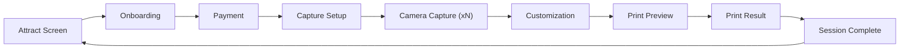
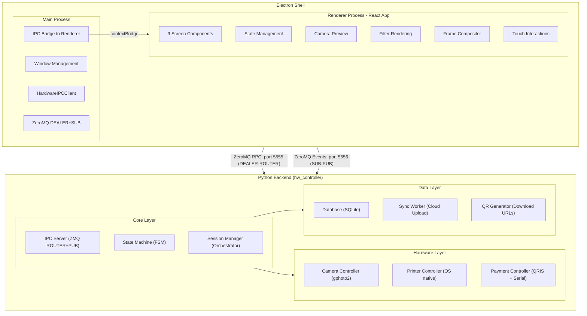
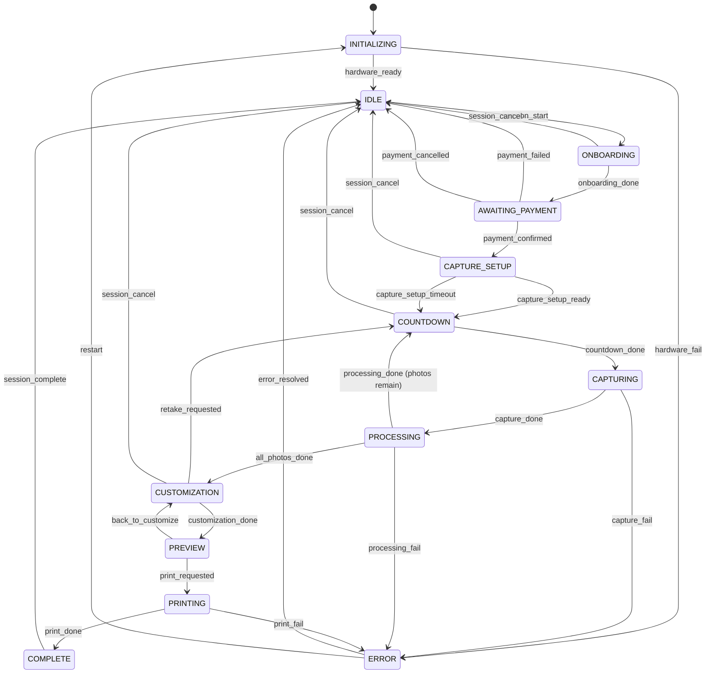
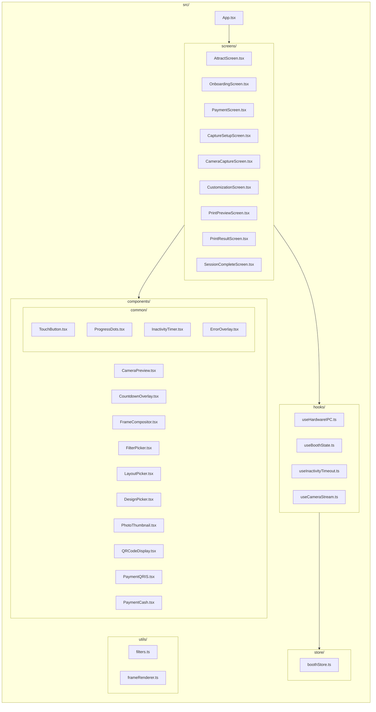
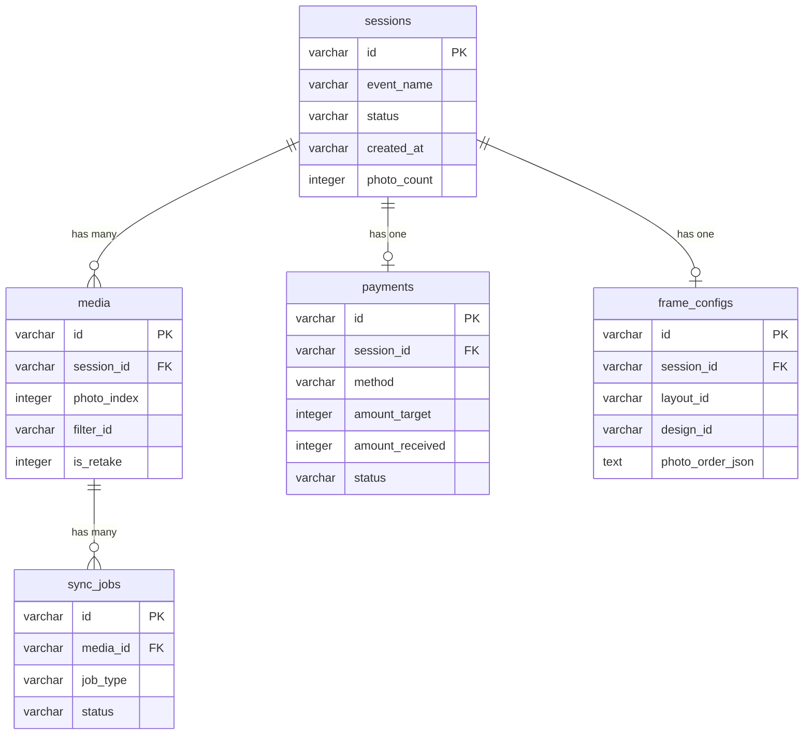
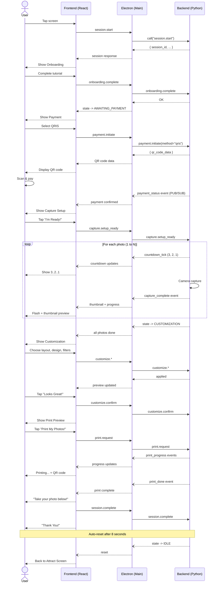
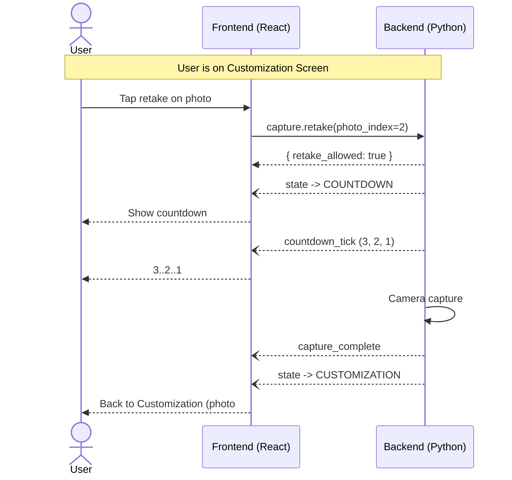

# Kiosk-Mode Web-Based Photobooth Application — Product Requirements Document

---

## Table of Contents

1. [Product Overview](#1-product-overview)
2. [User Flow & Screen Specifications](#2-user-flow--screen-specifications)
3. [Technical Architecture](#3-technical-architecture)
4. [API Specification](#4-api-specification)
5. [Database Schema](#5-database-schema)
6. [Configuration](#6-configuration)
7. [Admin Panel](#7-admin-panel)

---

## 1. Product Overview

### 1.1 Vision

A full-screen, kiosk-mode web-based photobooth application intended for touchscreen kiosks connected to a DSLR camera and a photo printer. The system operates unattended in public spaces (events, malls, parties), accepting payment via QRIS or cash/coin, guiding users through a photo session, and delivering a printed photo strip with an online download option via QR code.

### 1.2 Target Users

- **Primary**: Event guests, mall visitors, party attendees — ages 10–60, no technical knowledge assumed.
- **Secondary**: Event organizers and venue operators managing the kiosk remotely.

### 1.3 Tech Stack

| Layer    | Technology                                                  |
| -------- | ----------------------------------------------------------- |
| Shell    | Electron (main process, window management, hardware bridge) |
| Frontend | React (renderer process, all UI screens)                    |
| Backend  | Python 3.11+ (asyncio, hardware control, session logic)     |
| IPC      | ZeroMQ (JSON-RPC 2.0 for RPC, PUB/SUB for events)           |
| Database | SQLite (local persistence, WAL mode)                        |
| Camera   | gphoto2 (DSLR control)                                      |
| Printer  | OS-native silent printing (PowerShell / lpr / lp)           |
| Payment  | QRIS gateway API + serial/USB coin acceptor                 |

### 1.4 Core Kiosk Constraints (Global Rules)

- Full-screen only — no browser chrome, no window decorations
- Touch-first interaction model
- Minimum 48px touch targets
- No keyboard or mouse dependency
- Automatic progression where possible
- Inactivity timeout on every screen (configurable, default 60s)
- Automatic session reset after completion or timeout
- No user authentication required
- Fail-safe recovery for camera, printer, and payment hardware errors
- All session data cleared between users

---

## 2. User Flow & Screen Specifications

### 2.0 Flow Overview

**State-to-screen mapping:**

| # | Screen | Backend State |
|---|---|---|
| 1 | Attract / Idle | `IDLE` |
| 2 | Onboarding | `ONBOARDING` |
| 3 | Payment | `AWAITING_PAYMENT` |
| 4 | Capture Setup | `CAPTURE_SETUP` |
| 5 | Camera Capture | `COUNTDOWN` → `CAPTURING` → `PROCESSING` (loop) |
| 6 | Customization | `CUSTOMIZATION` |
| 7 | Print Preview & Confirmation | `PREVIEW` |
| 8 | Print Result & QR | `PRINTING` |
| 9 | Session Complete | `COMPLETE` |

---

### 2.1 Attract / Idle Screen

#### Purpose
Attract passersby and invite interaction. This is the default resting state of the kiosk.

#### Elements
- Full-screen idle content (animation or static)
- Central call-to-action prompt
- Optional: event branding / logo overlay (admin-configured)

#### Behavior
- Tap anywhere on screen to begin → transition to Onboarding
- Loop idle content continuously
- No navigation or system UI visible
- Returns here automatically after session complete or inactivity timeout from any screen

#### Backend State
- `IDLE` — no active session, all hardware on standby

---

### 2.2 Onboarding Screen

#### Purpose
Introduce the user to the photobooth experience with a brief tutorial explaining how the system works.

#### Elements
- Horizontally paginated cards (swipeable or auto-advancing)
- Each card: illustration + short text (1–2 sentences)
- Page indicator + "Skip" button + "Next" / "Get Started" button

#### Content (3–4 tutorial cards)

1. **"Strike a Pose!"** — Text: "Stand in front of the camera and we'll take [N] photos of you automatically."
2. **"Customize Your Frame"** — Text: "Choose your favorite layout, design, and add fun filters to each photo."
3. **"Print & Download"** — Text: "Get your photos printed instantly and scan the QR code to download them online."
4. **"Let's Go!"** — Pricing info. Text: "Starting at [price]. Pay with QRIS or cash to begin!" + "Start" button.

#### Behavior
- Auto-advance cards every 5 seconds (configurable)
- User can swipe or tap Next to advance manually
- "Skip" button jumps directly to Payment screen
- Final card's "Start" button → transition to Payment screen
- Inactivity timeout → return to Attract screen

#### Backend State
- `ONBOARDING` — session created but not yet paid

---

### 2.3 Payment Screen

#### Purpose
Collect payment before starting the photo session. Supports both QRIS (digital) and cash/coin (physical) payment methods.

#### Elements
- Toggle or tabs between payment methods (QRIS / Cash)
- QRIS section: QR code image, instructions
- Cash section: amount inserted indicator, remaining amount
- Package/pricing summary
- Payment status indicator and cancel button

#### Content
- Title: **"Choose Payment Method"**
- Package info: "[N] photos + printed strip — Rp [price]"
- QRIS section: dynamically generated QR code, "Scan with any e-wallet app", payment status indicator
- Cash section: "Insert Rp [price]", real-time amount received counter, remaining amount display
- Cancel button: "Cancel" (returns to Attract screen)

#### Behavior
- **QRIS flow**: Backend generates payment QR → frontend displays it → backend polls payment gateway for status → on success, auto-advance to Capture Setup
- **Cash flow**: Backend listens to coin acceptor serial events → frontend updates amount in real-time → when target reached, auto-advance to Capture Setup
- Payment timeout (configurable, default 120s) → show "Payment timed out" → return to Attract screen
- On payment failure: friendly error message + option to retry or cancel
- Partial cash refund not supported — display clear warning before accepting partial amounts

#### Backend State
- `AWAITING_PAYMENT` — payment initiated, waiting for confirmation

---

### 2.4 Capture Setup Screen

#### Purpose
Show the live camera feed so users can position themselves and prepare before the photo session begins.

#### Elements
- Full-screen live camera preview (mirrored for natural selfie experience)
- Overlay: frame guide showing the capture area
- Session info: photo count ("You'll take [N] photos")
- "I'm Ready!" button

#### Behavior
- Live camera feed displayed via backend streaming (MJPEG or WebSocket frames)
- Tap "I'm Ready!" → transition to Camera Capture screen (first photo countdown)
- Auto-advance after idle timeout (configurable, default 30s) — starts automatically
- Camera error → show friendly error overlay, attempt auto-reconnect

#### Backend State
- `CAPTURE_SETUP` — camera active, streaming preview, waiting for user confirmation

---

### 2.5 Camera Capture Screen

#### Purpose
Automated multi-photo capture experience with countdown before each shot. This screen handles the full capture loop for all N photos.

#### Elements
- Full-screen live camera preview (continues from setup)
- Countdown overlay (3 → 2 → 1)
- Photo progress indicator: "Photo [current] of [total]"
- Capture feedback (flash/shutter indicator)
- Brief captured photo thumbnail after each shot

#### Behavior (per-photo cycle)
1. **Countdown phase** (3 seconds default): Numbers count down. No user controls during countdown.
2. **Capture moment**: Capture feedback indicator, shutter sound (optional). Camera triggers automatically.
3. **Processing phase**: Brief loading indicator while thumbnail generates.
4. **Preview flash**: Captured photo thumbnail appears briefly (1s) as a small overlay.
5. **Next photo**: If more photos remain, short pause (1s), then next countdown begins automatically.
6. **All done**: After the last photo is captured and processed, auto-advance to Customization screen.

#### Timing
- Countdown: configurable (default 3s per photo)
- Pause between photos: configurable (default 2s)
- Total session for 4 photos: ~24 seconds

#### Error Handling
- Camera capture failure → show error overlay → attempt auto-retry once → if still fails, offer "Skip this photo" or "Cancel session"
- Camera disconnect → pause session → attempt auto-reconnect → resume or abort

#### Backend States (cycles through per photo)
- `COUNTDOWN` → `CAPTURING` → `PROCESSING` → (loop back to `COUNTDOWN` or advance)

---

### 2.6 Customization Screen

#### Purpose
Allow users to choose their frame layout, design template, arrange photo order within the frame, apply filters to individual photos, and optionally retake photos (max 1 retake per photo).

#### Elements
- Live preview of the assembled frame with photos
- Control panel with tabbed sections

#### Control Panel Tabs

**Tab 1: Layout**
- Selectable layout options (photo strip vertical, photo strip horizontal, 2×2 grid, single large + small collage, etc.)
- One-tap selection, preview updates immediately

**Tab 2: Design**
- Frame design/theme presets (admin-managed)
- Each preset defines border style, background, and overlay elements
- One-tap selection, preview updates immediately

**Tab 3: Photos**
- Thumbnail grid of all captured photos
- Drag-and-drop (or tap-to-swap) to reorder photos within the frame slots
- Per-photo actions:
  - **Filter**: tap filter icon → opens filter picker (Original, B&W, Sepia, Warm, Cool, Vintage — applied per-photo)
  - **Retake**: tap retake icon → confirmation → returns to single-photo capture flow → replaces the photo (max 1 retake per photo, disabled after use)

#### Content
- Confirm button: "Looks Great!"
- Timer indicator: remaining time for customization (configurable, default 120s)

#### Behavior
- All changes apply instantly to the live preview
- Retake flow: tap retake on a photo → confirmation "Retake this photo?" → if yes, transitions to a single-photo capture (countdown → capture → process) → returns to customization with the new photo replacing the old one
- Each photo can only be retaken once — retake icon shows disabled state after use
- Filters are applied client-side for instant preview; final high-res filter rendering done server-side
- "Looks Great!" button → transition to Print Preview
- Inactivity timeout → auto-confirm with current selections
- If no customization is done, default layout and design are pre-selected

#### Backend State
- `CUSTOMIZATION` — session in customization phase, accepting layout/design/filter/retake commands

---

### 2.7 Print Preview & Confirmation Screen

#### Purpose
Show the final composed frame exactly as it will be printed, giving the user one last chance to confirm or go back.

#### Elements
- Final frame preview (actual print proportions, e.g., 4×6 or 2×6 strip)
- "Print My Photos!" button (primary action)
- "Go Back & Edit" button (secondary action)

#### Behavior
- "Print My Photos!" → backend renders final high-resolution composite → sends to printer → transition to Print Result screen
- "Go Back & Edit" → return to Customization screen (preserves all selections)
- Auto-print after idle timeout (configurable, default 30s)
- Loading overlay while final image is being rendered server-side

#### Backend State
- `PREVIEW` — final composite being prepared/confirmed

---

### 2.8 Print Result & QR Download Screen

#### Purpose
Provide feedback during printing and offer a QR code for online download of the digital version.

#### Elements
- Print status area with progress indicator
- QR code for digital download
- Download URL expiry info

#### Content
- Print status: "Printing..." → "Your photo is ready!"
- QR code: links to a unique download URL for this session's photos
- QR instruction: "Scan with your phone camera to download"
- Expiry note: "Available for [N] days" (configurable)

#### Behavior
- Print job starts automatically upon entering this screen
- QR code is generated by the backend and displayed alongside the print status
- On print success: "Please take your photo below!"
- On print failure: error message, option to retry printing or skip to QR-only
- User can scan QR code while print is in progress
- Auto-advance to Session Complete after timeout (configurable, default 30s after print completes)

#### Backend State
- `PRINTING` — print job active; QR/download URL generated and synced

---

### 2.9 Session Complete / Auto Reset Screen

#### Purpose
End the session cleanly with a thank-you message and prepare for the next user.

#### Elements
- Thank-you message
- Auto-reset countdown indicator

#### Content
- "Thank You!" message
- Countdown: "Next session starting in [N]..."

#### Behavior
- Auto-reset countdown (configurable, default 8 seconds)
- Clears all session data from memory (photos remain on disk for sync)
- Returns to Attract Screen automatically
- Tapping the screen immediately returns to Attract Screen

#### Backend State
- `COMPLETE` → transitions to `IDLE` after cleanup

---

## 3. Technical Architecture

### 3.1 System Overview

### 3.2 State Machine (Updated)

The backend FSM must be extended from the current 8 states to 13 states to support the full user flow.

#### States

| State | Description |
|---|---|
| `INITIALIZING` | Hardware check on startup |
| `IDLE` | Attract screen, waiting for user |
| `ONBOARDING` | Tutorial flow active |
| `AWAITING_PAYMENT` | Payment screen, waiting for QRIS or cash |
| `CAPTURE_SETUP` | Live preview, user positioning |
| `COUNTDOWN` | Countdown before each photo |
| `CAPTURING` | Camera shutter triggered |
| `PROCESSING` | Photo post-processing (thumbnail, etc.) |
| `CUSTOMIZATION` | Frame layout, design, filter, reorder, retake |
| `PREVIEW` | Final print preview confirmation |
| `PRINTING` | Print job active |
| `COMPLETE` | Session done, auto-reset pending |
| `ERROR` | Recoverable error state |

#### Triggers

| Trigger | Description |
|---|---|
| `hardware_ready` | All hardware initialized successfully |
| `hardware_fail` | Hardware initialization failed |
| `session_start` | User tapped "Start" on Attract screen |
| `onboarding_done` | User completed or skipped onboarding |
| `payment_initiated` | Payment method selected, awaiting funds |
| `payment_confirmed` | Payment received and verified |
| `payment_failed` | Payment timed out or was declined |
| `payment_cancelled` | User cancelled payment |
| `capture_setup_ready` | User tapped "I'm Ready" |
| `capture_setup_timeout` | Auto-advance from setup |
| `countdown_done` | Countdown reached zero |
| `capture_done` | Photo captured and saved |
| `capture_fail` | Camera error during capture |
| `processing_done` | Thumbnail/post-processing complete |
| `processing_fail` | Post-processing error |
| `all_photos_done` | All N photos captured and processed |
| `next_photo` | Advance to next photo in sequence |
| `retake_requested` | User wants to retake a specific photo |
| `customization_done` | User confirmed frame customization |
| `print_requested` | User confirmed print on preview screen |
| `back_to_customize` | User wants to go back to customization |
| `print_done` | Print job completed successfully |
| `print_fail` | Printer error |
| `session_complete` | Session fully complete, begin reset |
| `session_cancel` | Session cancelled at any point |
| `error_resolved` | Error condition cleared |
| `restart` | Full system restart requested |

#### Transition Table

### 3.3 Frontend Architecture (React)

#### State Management
- Global state store (Zustand or Redux Toolkit) synchronized with backend state via IPC events
- Screen routing driven by backend state — each backend state maps to exactly one screen component
- Local UI state for animations, form inputs, filter previews

#### Screen Components

#### Camera Preview Streaming
- Backend streams MJPEG over a local HTTP endpoint (e.g., `http://127.0.0.1:8080/preview`)
- React component renders via `` tag with MJPEG source (simplest, lowest latency)
- Alternative: WebSocket binary frames for lower overhead (future optimization)

#### Client-Side Filter Rendering
- Filters applied using HTML5 Canvas or CSS `filter` property for instant preview
- Filter presets defined as CSS filter chains (e.g., `grayscale(100%)`, `sepia(80%)`, custom LUTs)
- Final high-resolution filter rendering happens server-side (Pillow) before print

### 3.4 IPC Communication

The existing ZeroMQ-based IPC architecture is preserved and extended:

- **RPC Channel** (ROUTER↔DEALER on port 5555): synchronous request/response for commands
- **Event Channel** (PUB→SUB on port 5556): real-time broadcast from backend to frontend

All messages use JSON-RPC 2.0 format. Events use a topic-based PUB/SUB model.

### 3.5 Payment Integration

#### QRIS
- Backend integrates with a QRIS payment gateway API (e.g., Midtrans, Xendit, or similar)
- Flow: backend generates a payment request → receives QR code data → frontend displays QR → backend polls gateway for payment status → on success, fires `payment_confirmed`
- Timeout: configurable (default 120s)

#### Cash / Coin Acceptor
- Backend communicates with coin/bill acceptor via serial port (RS-232 or USB-serial)
- Protocol: device-specific (e.g., MDB, ccTalk, or proprietary pulse protocol)
- Flow: backend opens serial connection → listens for coin insert events → accumulates amount → when target reached, fires `payment_confirmed`
- Partial payment tracking: frontend shows real-time amount received

---

## 4. API Specification

### 4.1 RPC Methods

All RPC methods follow JSON-RPC 2.0 format. Request: `{ "jsonrpc": "2.0", "id": "<uuid>", "method": "<method>", "params": { ... } }`. Response: `{ "jsonrpc": "2.0", "id": "<uuid>", "result": { ... } }` or `{ "jsonrpc": "2.0", "id": "<uuid>", "error": { "code": <int>, "message": "<string>" } }`.

#### Session Methods

**`session.start`** — Create a new session and move to ONBOARDING.

| Param | Type | Required | Description |
|---|---|---|---|
| `event_name` | string | No | Optional event name for branding |
| `photos_per_session` | int | No | Override default photo count |
| `countdown_seconds` | int | No | Override default countdown |

Returns: `{ "session_id": "<uuid>", "photos_target": 4, "countdown_seconds": 3 }`

**`session.cancel`** — Cancel the active session and return to IDLE.

Returns: `{ "session_id": "<uuid>", "status": "cancelled" }`

**`session.complete`** — Finalize session, queue sync, transition to COMPLETE.

Returns: `{ "session_id": "<uuid>", "status": "completed" }`

**`session.get_status`** — Get current session info.

Returns: `{ "session_id": "<uuid>", "state": "<state>", "photo_index": 2, "photos_target": 4, "payment_status": "paid" }`

---

#### Onboarding Methods

**`onboarding.complete`** — Mark onboarding as done, advance to AWAITING_PAYMENT.

Returns: `{ "session_id": "<uuid>", "next_state": "AWAITING_PAYMENT" }`

**`onboarding.skip`** — Skip onboarding, advance to AWAITING_PAYMENT.

Returns: `{ "session_id": "<uuid>", "next_state": "AWAITING_PAYMENT" }`

---

#### Payment Methods

**`payment.initiate`** — Begin payment process.

| Param | Type | Required | Description |
|---|---|---|---|
| `method` | string | Yes | `"qris"` or `"cash"` |
| `amount` | int | Yes | Amount in IDR (smallest unit) |
| `package_id` | string | No | Pricing package identifier |

Returns (QRIS): `{ "payment_id": "<uuid>", "qr_code_url": "<url>", "qr_code_data": "<base64>", "expires_at": "<iso8601>" }`

Returns (Cash): `{ "payment_id": "<uuid>", "target_amount": 50000, "current_amount": 0 }`

**`payment.check_status`** — Poll current payment status.

Returns: `{ "payment_id": "<uuid>", "status": "pending|confirmed|failed|expired", "amount_received": 30000, "amount_target": 50000 }`

**`payment.cancel`** — Cancel payment and return to IDLE.

Returns: `{ "payment_id": "<uuid>", "status": "cancelled" }`

---

#### Capture Methods

**`capture.setup_ready`** — User is ready, begin photo session.

Returns: `{ "session_id": "<uuid>", "starting_countdown": true }`

**`capture.get_preview_url`** — Get the camera live preview stream URL.

Returns: `{ "preview_url": "http://127.0.0.1:8080/preview", "format": "mjpeg" }`

**`capture.trigger`** — Manually trigger a capture (if not auto-capture).

Returns: `{ "photo_index": 2, "file_path": "<path>", "thumbnail_path": "<path>" }`

**`capture.retake`** — Retake a specific photo (from Customization screen).

| Param | Type | Required | Description |
|---|---|---|---|
| `photo_index` | int | Yes | Index of the photo to retake (1-based) |

Returns: `{ "photo_index": 2, "retake_allowed": true, "previous_retakes": 0 }`

Error: `{ "code": -32010, "message": "Retake limit reached for this photo" }`

---

#### Customization Methods

**`customize.set_layout`** — Set the frame layout.

| Param | Type | Required | Description |
|---|---|---|---|
| `layout_id` | string | Yes | Layout identifier (e.g., "strip_vertical", "grid_2x2") |

Returns: `{ "layout_id": "strip_vertical", "applied": true }`

**`customize.set_design`** — Set the frame design/theme.

| Param | Type | Required | Description |
|---|---|---|---|
| `design_id` | string | Yes | Design template identifier |

Returns: `{ "design_id": "floral_pink", "applied": true }`

**`customize.apply_filter`** — Apply a filter to a specific photo.

| Param | Type | Required | Description |
|---|---|---|---|
| `photo_index` | int | Yes | Photo index (1-based) |
| `filter_id` | string | Yes | Filter identifier (e.g., "original", "bw", "sepia", "warm", "cool", "vintage") |

Returns: `{ "photo_index": 2, "filter_id": "sepia", "applied": true }`

**`customize.reorder_photos`** — Set the photo order in the frame.

| Param | Type | Required | Description |
|---|---|---|---|
| `order` | int[] | Yes | Array of photo indices in display order |

Returns: `{ "order": [3, 1, 4, 2], "applied": true }`

**`customize.confirm`** — Confirm customization, advance to PREVIEW.

Returns: `{ "session_id": "<uuid>", "composite_preview_url": "<url>" }`

---

#### Print Methods

**`print.request`** — Render final composite and send to printer.

| Param | Type | Required | Description |
|---|---|---|---|
| `copies` | int | No | Number of copies (default 1) |

Returns: `{ "print_job_id": "<uuid>", "status": "queued" }`

**`print.get_status`** — Check print job status.

Returns: `{ "print_job_id": "<uuid>", "status": "queued|rendering|printing|done|failed", "progress_pct": 75 }`

---

#### Download / QR Methods

**`download.generate_qr`** — Generate a QR code linking to the session's download page.

Returns: `{ "qr_code_data": "<base64_png>", "download_url": "https://photos.example.com/dl/<token>", "expires_at": "<iso8601>" }`

**`download.get_url`** — Get the download URL for the session.

Returns: `{ "download_url": "https://photos.example.com/dl/<token>", "files": [ { "type": "composite", "url": "..." }, { "type": "individual", "index": 1, "url": "..." } ] }`

---

#### System Methods

**`system.get_state`** — Get current backend state machine status.

Returns: `{ "state": "IDLE", "error_context": null, "available_triggers": ["session_start"] }`

**`system.health`** — Health check for all subsystems.

Returns: `{ "camera": "connected", "printer": "ready", "payment_hw": "connected", "database": "ok", "uptime_seconds": 3600 }`

---

### 4.2 Event Types (PUB/SUB)

Events are published on the PUB socket with topic-based routing. Format: `{ "event": "<event_name>", "data": { ... } }`.

| Event | Data | Description |
|---|---|---|
| `state_changed` | `{ "prev": "IDLE", "next": "ONBOARDING", "trigger": "session_start" }` | Backend state transition |
| `countdown_tick` | `{ "remaining": 2, "photo_index": 1 }` | Countdown update (every second) |
| `capture_complete` | `{ "photo_index": 2, "thumbnail_url": "...", "photos_remaining": 2 }` | Photo captured |
| `processing_complete` | `{ "photo_index": 2, "thumbnail_path": "..." }` | Post-processing done |
| `payment_status` | `{ "payment_id": "...", "status": "confirmed", "amount_received": 50000 }` | Payment state change |
| `cash_inserted` | `{ "amount": 10000, "total_received": 30000, "remaining": 20000 }` | Cash/coin inserted |
| `print_progress` | `{ "print_job_id": "...", "status": "printing", "progress_pct": 50 }` | Print progress update |
| `error` | `{ "code": -32001, "message": "Camera disconnected", "recoverable": true }` | Error notification |
| `session_timeout` | `{ "screen": "payment", "timeout_seconds": 120 }` | Inactivity timeout warning |
| `camera_preview_ready` | `{ "preview_url": "http://..." }` | Camera preview stream available |

### 4.3 Error Codes

| Code | Constant | Description |
|---|---|---|
| -32700 | `PARSE_ERROR` | Invalid JSON |
| -32600 | `INVALID_REQUEST` | Missing required fields |
| -32601 | `METHOD_NOT_FOUND` | Unknown RPC method |
| -32602 | `INVALID_PARAMS` | Invalid method parameters |
| -32603 | `INTERNAL_ERROR` | Unexpected server error |
| -32001 | `CAMERA_ERROR` | Camera hardware error |
| -32002 | `PRINTER_ERROR` | Printer hardware error |
| -32003 | `STATE_ERROR` | Invalid state transition |
| -32004 | `PAYMENT_ERROR` | Payment processing error |
| -32005 | `PAYMENT_HW_ERROR` | Payment hardware (coin acceptor) error |
| -32010 | `RETAKE_LIMIT` | Photo retake limit exceeded |
| -32011 | `SESSION_EXPIRED` | Session timed out |

---

## 5. Database Schema

### 5.1 Entity Relationship

### 5.2 Tables

#### `sessions`

| Column | Type | Constraints | Description |
|---|---|---|---|
| `id` | VARCHAR(36) | PK, default UUID | Session identifier |
| `event_name` | VARCHAR(255) | nullable | Optional event name |
| `status` | VARCHAR(20) | NOT NULL, default "active" | active, paid, capturing, customizing, printing, completed, cancelled, expired |
| `created_at` | VARCHAR(30) | NOT NULL, default now() | ISO 8601 UTC |
| `completed_at` | VARCHAR(30) | nullable | ISO 8601 UTC |
| `photo_count` | INTEGER | NOT NULL, default 0 | Number of photos taken |
| `photos_target` | INTEGER | NOT NULL, default 4 | Target photo count |
| `layout_id` | VARCHAR(50) | nullable | Selected frame layout |
| `design_id` | VARCHAR(50) | nullable | Selected frame design |
| `composite_path` | TEXT | nullable | Path to final rendered composite |
| `download_token` | VARCHAR(64) | nullable, unique | Token for download URL |
| `download_expires_at` | VARCHAR(30) | nullable | Download link expiry |
| `metadata_json` | TEXT | nullable | Arbitrary JSON metadata |

#### `payments`

| Column | Type | Constraints | Description |
|---|---|---|---|
| `id` | VARCHAR(36) | PK, default UUID | Payment identifier |
| `session_id` | VARCHAR(36) | FK → sessions.id, NOT NULL | Associated session |
| `method` | VARCHAR(10) | NOT NULL | "qris" or "cash" |
| `amount_target` | INTEGER | NOT NULL | Expected amount in IDR |
| `amount_received` | INTEGER | NOT NULL, default 0 | Amount received so far |
| `status` | VARCHAR(20) | NOT NULL, default "pending" | pending, confirmed, failed, cancelled, expired, refunded |
| `transaction_ref` | VARCHAR(255) | nullable | External transaction reference (QRIS gateway) |
| `qr_code_data` | TEXT | nullable | QR code payload (QRIS only) |
| `created_at` | VARCHAR(30) | NOT NULL, default now() | ISO 8601 UTC |
| `confirmed_at` | VARCHAR(30) | nullable | When payment was confirmed |
| `expires_at` | VARCHAR(30) | nullable | Payment expiry time |
| `metadata_json` | TEXT | nullable | Gateway response data, etc. |

Indexes: `ix_payments_session (session_id)`, `ix_payments_status (status)`

#### `media`

| Column | Type | Constraints | Description |
|---|---|---|---|
| `id` | VARCHAR(36) | PK, default UUID | Media identifier |
| `session_id` | VARCHAR(36) | FK → sessions.id, NOT NULL | Associated session |
| `photo_index` | INTEGER | NOT NULL | Original capture index (1-based) |
| `slot_index` | INTEGER | nullable | Position in the frame layout (1-based) |
| `file_path` | TEXT | NOT NULL | Path to full-resolution photo |
| `thumbnail_path` | TEXT | nullable | Path to thumbnail |
| `file_size_bytes` | INTEGER | nullable | File size |
| `width` | INTEGER | nullable | Image width in pixels |
| `height` | INTEGER | nullable | Image height in pixels |
| `filter_id` | VARCHAR(30) | nullable, default "original" | Applied filter identifier |
| `is_retake` | INTEGER | NOT NULL, default 0 | 1 if this is a retake |
| `retake_of` | VARCHAR(36) | FK → media.id, nullable | ID of the photo this replaces |
| `retake_count` | INTEGER | NOT NULL, default 0 | Times this slot has been retaken (max 1) |
| `captured_at` | VARCHAR(30) | NOT NULL, default now() | ISO 8601 UTC |
| `printed` | INTEGER | NOT NULL, default 0 | 1 if included in print |
| `metadata_json` | TEXT | nullable | EXIF data, etc. |

Indexes: `ix_media_session (session_id)`

#### `frame_configs`

| Column | Type | Constraints | Description |
|---|---|---|---|
| `id` | VARCHAR(36) | PK, default UUID | Config identifier |
| `session_id` | VARCHAR(36) | FK → sessions.id, NOT NULL, UNIQUE | Associated session |
| `layout_id` | VARCHAR(50) | NOT NULL | Layout template ID |
| `design_id` | VARCHAR(50) | NOT NULL | Design/theme template ID |
| `photo_order_json` | TEXT | NOT NULL | JSON array of photo indices in display order |
| `custom_text` | TEXT | nullable | Optional custom text overlay |
| `created_at` | VARCHAR(30) | NOT NULL, default now() | ISO 8601 UTC |
| `updated_at` | VARCHAR(30) | NOT NULL, default now() | Last modification |

#### `sync_jobs`

| Column | Type | Constraints | Description |
|---|---|---|---|
| `id` | VARCHAR(36) | PK, default UUID | Job identifier |
| `media_id` | VARCHAR(36) | FK → media.id, nullable | Associated media (for photo uploads) |
| `session_id` | VARCHAR(36) | FK → sessions.id, nullable | Associated session (for session uploads) |
| `job_type` | VARCHAR(30) | NOT NULL | upload_photo, upload_composite, upload_session |
| `status` | VARCHAR(20) | NOT NULL, default "pending" | pending, in_progress, completed, failed |
| `attempts` | INTEGER | NOT NULL, default 0 | Attempt count |
| `max_attempts` | INTEGER | NOT NULL, default 5 | Max retry attempts |
| `target_url` | TEXT | nullable | Upload destination URL |
| `error_message` | TEXT | nullable | Last error message |
| `created_at` | VARCHAR(30) | NOT NULL, default now() | ISO 8601 UTC |
| `last_attempt_at` | VARCHAR(30) | nullable | Last attempt timestamp |
| `completed_at` | VARCHAR(30) | nullable | Completion timestamp |

Indexes: `ix_sync_status (status)`, `ix_sync_session (session_id)`

---

## 6. Configuration

All configuration is centralized in `hw_controller/config.py` with environment variable overrides. The following settings are needed for the full application:

### 6.1 Paths

| Env Var | Default | Description |
|---|---|---|
| `PB_BASE_DIR` | Project root | Base directory for all data |
| `PB_DATA_DIR` | `<base>/data` | Data storage root |
| `PB_SESSION_DIR` | `<data>/sessions` | Per-session photo storage |
| `PB_DB_PATH` | `<data>/photobooth.db` | SQLite database path |

### 6.2 ZeroMQ

| Env Var | Default | Description |
|---|---|---|
| `PB_ZMQ_RPC_PORT` | `5555` | RPC ROUTER port |
| `PB_ZMQ_PUB_PORT` | `5556` | Event PUB port |

### 6.3 Camera

| Env Var | Default | Description |
|---|---|---|
| `PB_CAMERA_RECONNECT_ATTEMPTS` | `5` | Max reconnect retries |
| `PB_CAMERA_RECONNECT_INTERVAL` | `2.0` | Seconds between retries |
| `PB_PREVIEW_PORT` | `8080` | MJPEG preview HTTP port |
| `PB_PREVIEW_FPS` | `15` | Preview stream frame rate |
| `PB_PREVIEW_QUALITY` | `70` | JPEG quality for preview stream |

### 6.4 Session

| Env Var | Default | Description |
|---|---|---|
| `PB_PHOTOS_PER_SESSION` | `4` | Default photos per session |
| `PB_COUNTDOWN_SECONDS` | `3` | Countdown duration per photo |
| `PB_PAUSE_BETWEEN_PHOTOS` | `2` | Seconds between photo captures |
| `PB_MAX_RETAKES_PER_PHOTO` | `1` | Maximum retakes allowed per photo |

### 6.5 Payment

| Env Var | Default | Description |
|---|---|---|
| `PB_PAYMENT_AMOUNT` | `50000` | Default price in IDR |
| `PB_PAYMENT_TIMEOUT` | `120` | Payment timeout in seconds |
| `PB_QRIS_GATEWAY_URL` | — | QRIS payment gateway API URL |
| `PB_QRIS_API_KEY` | — | QRIS gateway API key |
| `PB_QRIS_MERCHANT_ID` | — | QRIS merchant identifier |
| `PB_CASH_SERIAL_PORT` | — | Serial port for coin acceptor (e.g., COM3, /dev/ttyUSB0) |
| `PB_CASH_BAUD_RATE` | `9600` | Coin acceptor baud rate |

### 6.6 Printer

| Env Var | Default | Description |
|---|---|---|
| `PB_PRINT_TIMEOUT` | `30` | Print timeout in seconds |
| `PB_PRINTER_NAME` | — | Specific printer name (empty = system default) |
| `PB_PRINT_COPIES` | `1` | Default print copies |
| `PB_PRINT_SIZE` | `4x6` | Print size (4x6, 2x6) |

### 6.7 Download / QR

| Env Var | Default | Description |
|---|---|---|
| `PB_DOWNLOAD_BASE_URL` | — | Base URL for download links (e.g., https://photos.example.com) |
| `PB_DOWNLOAD_EXPIRY_DAYS` | `7` | Days before download link expires |
| `PB_QR_SIZE` | `300` | QR code image size in pixels |

### 6.8 Sync / Cloud

| Env Var | Default | Description |
|---|---|---|
| `PB_SYNC_MAX_ATTEMPTS` | `5` | Max upload retry attempts |
| `PB_SYNC_POLL_INTERVAL` | `30.0` | Seconds between sync worker polls |
| `PB_CLOUD_STORAGE_URL` | — | Cloud storage endpoint (S3/Supabase) |
| `PB_CLOUD_API_KEY` | — | Cloud storage API key |

### 6.9 Timeouts (Inactivity)

| Env Var | Default | Description |
|---|---|---|
| `PB_TIMEOUT_ONBOARDING` | `60` | Onboarding screen timeout (seconds) |
| `PB_TIMEOUT_PAYMENT` | `120` | Payment screen timeout |
| `PB_TIMEOUT_CAPTURE_SETUP` | `30` | Capture setup auto-advance |
| `PB_TIMEOUT_CUSTOMIZATION` | `120` | Customization screen timeout |
| `PB_TIMEOUT_PREVIEW` | `30` | Print preview auto-confirm |
| `PB_TIMEOUT_PRINT_RESULT` | `30` | Post-print auto-advance |
| `PB_TIMEOUT_COMPLETE` | `8` | Session complete auto-reset |

### 6.10 Customization Assets

| Env Var | Default | Description |
|---|---|---|
| `PB_LAYOUTS_DIR` | `<data>/assets/layouts` | Directory containing layout templates |
| `PB_DESIGNS_DIR` | `<data>/assets/designs` | Directory containing design/theme templates |
| `PB_FILTERS_CONFIG` | `<data>/assets/filters.json` | Filter presets configuration |

### 6.11 Logging

| Env Var | Default | Description |
|---|---|---|
| `PB_LOG_LEVEL` | `INFO` | Logging level |
| `PB_LOG_FILE` | — | Log file path (empty = stdout only) |

---

## 7. Admin Panel

The admin panel is a hidden interface accessible only by authorized operators, not visible during kiosk mode.

### 7.1 Access Method
- Hidden gesture: 5-tap on a corner of the Attract screen within 3 seconds
- Requires PIN code entry (configurable, default: `000000`)
- Admin session has its own inactivity timeout (5 minutes)

### 7.2 Admin Sections

#### Dashboard
- Today's session count and revenue
- Camera status (connected/disconnected, battery level if available)
- Printer status (ready, paper level if available, error state)
- Payment hardware status
- System uptime
- Last 10 sessions summary

#### Session Settings
- Photos per session
- Countdown duration
- Pause between photos
- Retake limit per photo
- Inactivity timeout values per screen

#### Payment Settings
- Price per session
- QRIS gateway configuration (URL, API key, merchant ID)
- Cash acceptor configuration (serial port, baud rate)
- Enable/disable specific payment methods
- Test payment (simulate QRIS / cash insert)

#### Hardware
- Camera: connect/disconnect, test capture, preview toggle
- Printer: test print, select printer, paper size
- Coin acceptor: test mode, calibration

#### Customization Management
- Upload/manage layout templates
- Upload/manage design/theme templates
- Set default layout and design
- Enable/disable specific layouts or designs
- Configure available filters

#### Event Branding
- Set event name
- Upload event logo
- Lock customization options (force specific layout/design for events)

#### Maintenance
- View recent error logs
- Export session data (CSV)
- Clear session history
- Restart subsystems (camera, printer, IPC)
- Full system restart
- Software update check

### 7.3 Admin API

Admin methods are prefixed with `admin.` and require a valid PIN in the params:

- `admin.authenticate` — Validate PIN, get admin token
- `admin.get_dashboard` — Get dashboard stats
- `admin.update_config` — Update configuration values
- `admin.test_camera` — Trigger test capture
- `admin.test_printer` — Send test print
- `admin.test_payment` — Simulate payment
- `admin.get_logs` — Retrieve recent logs
- `admin.export_sessions` — Export session data
- `admin.restart_subsystem` — Restart a specific subsystem

---

## Appendix A: Filter Presets

| Filter ID | CSS Filter Chain | Description |
|---|---|---|
| `original` | none | No filter applied |
| `bw` | `grayscale(100%)` | Black and white |
| `sepia` | `sepia(80%) saturate(120%)` | Warm sepia tone |
| `warm` | `saturate(130%) brightness(105%) hue-rotate(-10deg)` | Warm color shift |
| `cool` | `saturate(110%) brightness(105%) hue-rotate(15deg)` | Cool/blue color shift |
| `vintage` | `sepia(30%) contrast(110%) brightness(90%) saturate(85%)` | Faded vintage look |

---

## Appendix B: Frame Layout Templates

| Layout ID | Description | Photo Slots |
|---|---|---|
| `strip_vertical` | Classic vertical photo strip (2×6 inch) | 4 photos stacked vertically |
| `strip_horizontal` | Horizontal strip | 4 photos side by side |
| `grid_2x2` | 2×2 grid (4×6 inch) | 4 photos in grid |
| `collage_1_3` | 1 large + 3 small | 1 hero photo + 3 thumbnails |
| `single_large` | Single photo, large | 1 photo (best-of or first) |

---

## Appendix C: Sequence Diagrams

### C.1 Full Session Flow (Happy Path)

### C.2 Retake Flow

---

## Appendix D: Non-Functional Requirements

### Performance
- Camera preview: 15+ FPS at 640×480 minimum
- Photo capture to thumbnail: < 3 seconds
- Final composite rendering: < 5 seconds
- Print job submission: < 2 seconds
- QR code generation: < 1 second

### Reliability
- System must recover from camera disconnect within 10 seconds (auto-reconnect)
- Printer errors must not crash the application — graceful degradation to QR-only
- Payment hardware disconnect shows error and allows retry
- SQLite WAL mode for crash-resistant database operations
- All sessions persisted to disk before any hardware operations

### Security
- No user personal data stored beyond session photos
- Download tokens are random, unguessable (64-char hex)
- Download links expire after configurable period (default 7 days)
- Admin PIN required for configuration access
- QRIS API keys stored in environment variables, never in code
- No outbound network access required during normal operation (sync is background/best-effort)

### Scalability
- Single-kiosk deployment (no multi-kiosk coordination needed)
- Local SQLite database sufficient for single-device operation
- Cloud sync is eventual-consistency, best-effort
- Old session data auto-pruned after configurable retention period
